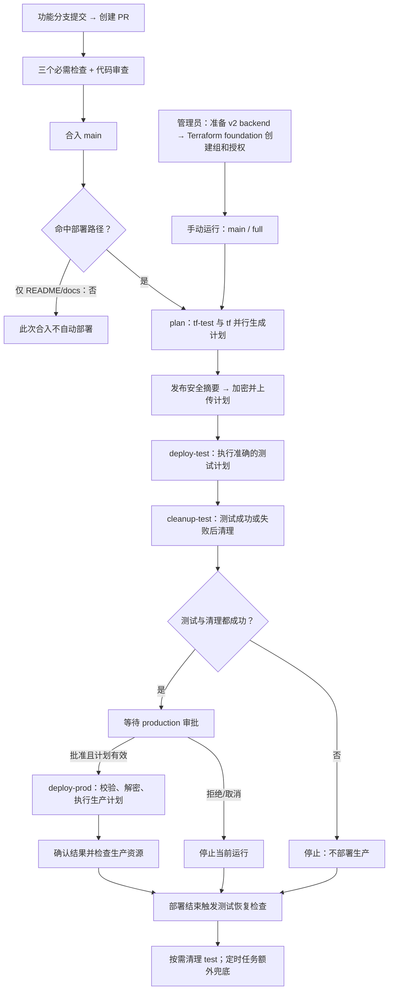

# GitHub Actions 部署与审批操作说明

本文说明 `gtsdrt/terraform` 从代码提交、PR 审查到 Azure 部署、销毁及测试恢复的完整流程，供提交者、审查者和部署审批人使用。

配置核对日期：2026-10-06；v2 初始化及首次 full 部署已经完成，运行与资源验收见[部署记录](DEPLOYMENT_RECORD_2026-10-06.md)。日常操作按本指南运行 main 的 `plan-only → full`。首次建立环境时先完成 [Terraform foundation 初始化](FRESH_START.md)，创建或接管资源组和授权。工作流和仓库设置后续可能调整，操作前以当前运行及环境设置为准。权限设计另见[安全架构](ARCHITECTURE.md)及[README](../README.md#从零初始化)。

## 日常部署操作

1. 用 `gtsdrt` 登录，确认待部署变更已合入 main、PR 检查通过，且没有尚未完成的完整部署或销毁。
2. 进入 **Actions → Terraform Deploy → Run workflow**，选择 **main / plan-only**。查看两个 plan 的变更摘要。
3. 预览符合预期后，以 `gtsdrt` 创建 **main / full** 运行。检查该 full 运行中的新摘要；它会重新生成准确计划。
4. 等待两个 plan、test apply 和 test cleanup 成功。以 `atea-shuangliang` 打开同一运行，选择 **Review deployments → production → Approve and deploy**。
5. 等待 `deploy-prod` 和整条运行显示 success，按第 12 节验收。test 组保留、组内临时资源为空是正常结果。

工作流若显示 Disabled，按下方启用步骤恢复。foundation 已完成后，日常部署继续使用现有资源组和 state；初始化脚本不属于每次 full 的执行步骤。

## 1. 先区分两种审批

| 操作 | 所在页面 | 按钮 | 审批后发生什么 |
|---|---|---|---|
| 代码审查 | Pull requests → 对应 PR → Files changed | Review changes → Approve → Submit review | PR 获得审查批准；代码尚未合入 |
| 合入代码 | 对应 PR → Conversation | Merge pull request / Confirm merge（或其他允许的合并方式） | 代码进入 main；是否部署取决于变更路径 |
| 生产部署或销毁审批 | Actions → 对应 workflow run → Summary | Review deployments → production → Approve and deploy | 当前运行获得生产环境许可，随后执行其已保存的计划 |

**PR 页面的 Approve 不会批准生产部署。** 看到 `Merge pull request` 表示当前位于 PR 页面，应进入 Actions 的具体运行页面查看部署审批请求。

当前仓库的 production 审批人是 `atea-shuangliang`，禁止自行审批，且管理员不能绕过。test 环境当前没有人工审批要求；两个环境均只接受 main 分支。

建议的账号分工：

| 账号 | 建议操作 |
|---|---|
| `gtsdrt` | 提交变更、在 PR 审查通过后合入代码、手动发起 full 部署或销毁 |
| `atea-shuangliang` | 审查 `gtsdrt` 的 PR；在 Actions 中审查并批准生产计划 |

PR 作者不能批准自己的 PR；当前 main 还要求代码所有者审查、一次有效批准及最后一次推送后的批准。新增提交会撤销旧批准，需要重新审查。

如果 `atea-shuangliang` 自己合入了会触发部署的变更或发起 full 运行，该运行也由这个账号发起，唯一生产审批人将无法自行批准。保持当前保护设置的处理方法是：取消该运行，再由 `gtsdrt` 创建一次新的 full 运行，然后由 `atea-shuangliang` 审批。切换浏览器登录账号不会改变已创建运行的发起人。

## 2. 工作流、环境与身份

| GitHub 工作流 | 配置文件 | 触发方式 | 用途 |
|---|---|---|---|
| Terraform PR Check | [pr-check.yml](../.github/workflows/pr-check.yml) | 面向 main 的所有 PR | 格式、Terraform 校验、安全测试、工作流语法和密钥扫描 |
| Terraform Deploy | [deploy.yml](../.github/workflows/deploy.yml) | main 上命中部署路径的 push；手动运行 | 只读预览或完整部署 |
| Terraform Destroy | [destroy.yml](../.github/workflows/destroy.yml) | 手动运行 | 先生成删除计划，再审批执行 |
| Terraform Test Recovery | [cleanup-test.yml](../.github/workflows/cleanup-test.yml) | 部署结束、每 6 小时、手动运行 | 清理临时 test 资源 |

| Terraform 目录 | 管理范围 | state 容器 / 文件 | 使用身份 |
|---|---|---|---|
| `tf-test/` | `terraform-test-v2` 内的 network 资源 | `tfstate-test/terraform-test-v2.tfstate` | `gtsdrt-terraform-test` |
| `tf/` | `terraform-prod-v2` 内的 network，以及 `azlandingzone-v2` 内的平台资源 | `tfstate-prod/executor-v2.tfstate` | `gtsdrt-terraform-prod` |
| plan job | 读取两个环境的资源和 state | 上述两个文件，只读 | `gtsdrt-terraform-plan` |

state 保存在存储账户 `gtsdrtterraform2`。三个 v2 资源组由管理员执行的 `tf-foundation/` 创建和管理，foundation state 独立保存在 `tfstate-foundation/foundation-v2.tfstate`。业务模块通过 data source 引用资源组；普通业务销毁与测试清理不会操作 foundation state。

GitHub 通过 OIDC 换取 Azure 短期身份，不在工作流中使用长期 Azure Client Secret。plan/test/prod 的 Client ID 必须互不相同。代码中的权限模型是资源组范围的管理权限及容器范围的数据权限，详情见[安全架构](ARCHITECTURE.md#认证和授权)。

plan 身份包含刷新 Storage 和 Log Analytics 所需的密钥读取操作，所以“只读”仍可能读取敏感信息。完整计划和原始 Terraform 输出不能公开发布。

### 工作流 Disabled 时如何启用

Disabled 是仓库工作流状态。合入代码后，之前手动停用的工作流仍需启用。在 **Actions → Terraform Deploy** 页面点击 **Enable workflow**；对 Terraform Destroy 和 Terraform Test Recovery 也分别启用。

有仓库 Actions 管理权限的账号也可以执行：

```bash
gh workflow enable deploy.yml --repo gtsdrt/terraform
gh workflow enable destroy.yml --repo gtsdrt/terraform
gh workflow enable cleanup-test.yml --repo gtsdrt/terraform
```

2026-10-06 核对时三个工作流均为 active。启用后新建 main 的运行；旧失败运行仍引用旧提交。

## 3. 整体流程图



测试失败时仍尝试清理；如果整个运行被取消，运行内的清理可能无法执行，后续独立恢复流程负责兜底。生产审批开始之前，正常情况下测试资源已经清理。

## 4. 提交、审查和合入 PR

当前 v2 已完成首次初始化。新环境上线或维护 foundation 时，先按 [FRESH_START](FRESH_START.md) 暂停写入工作流、从最新 main 准备 backend 并执行 foundation；正常业务变更遵循下面的 PR 流程。

1. 在功能分支修改代码并创建面向 main 的 PR。
2. 等待三个必需检查通过：`Terraform Validate (tf)`、`Terraform Validate (tf-test)`、`Security Checks`。新增 `Terraform Validate (tf-foundation)`，foundation 的 mock 权限测试也纳入必需的 Security Checks。
3. 审查者进入 PR 的 **Files changed**，检查差异，点击 **Review changes → Approve → Submit review**。
4. 解决所有审查讨论；如果又推送了提交，等待检查并重新获得批准。
5. 有合并权限的账号完成合入。对会触发部署的变更，建议由 `gtsdrt` 合入，让 `atea-shuangliang` 保持独立生产审批人的角色。

PR 检查也适用于 fork 和仅修改文档的 PR。它们不会接触 Azure 凭据、读取生产 state 或获得 OIDC 权限，也不会上传部署计划。

main 的部署路径是 `tf/**`、`tf-test/**`、`modules/**`、`.github/**`。命中这些路径的 main push 自动运行 full 部署；**仅修改 `README.md` 或 `docs/**` 不会自动部署**。

## 5. 只读预览：plan-only

在 [Actions](https://github.com/gtsdrt/terraform/actions) 选择 **Terraform Deploy → Run workflow**，分支选择 **main**，mode 选择 **plan-only**。

也可以在确认 GitHub CLI 当前登录账号后执行：

```bash
gh auth status
gh workflow run deploy.yml --repo gtsdrt/terraform --ref main -f mode=plan-only
```

此模式仅执行两个 plan job，发布资源动作和允许列表中的安全字段，不上传加密计划，不部署，不运行测试清理。它使用独立的 `terraform-preview` 队列，因此生产等待审批时仍可预览。

预览不持有写入锁，可能与正在执行的部署并发，结果仅供参考。生产审批应检查准备执行的那条 full 运行中的摘要。

## 6. 完整部署：full

### 发起运行

由 `gtsdrt` 在 **Terraform Deploy → Run workflow** 中选择 **main / full**；符合路径过滤的 main push 也会自动发起。

```bash
gh workflow run deploy.yml --repo gtsdrt/terraform --ref main -f mode=full
```

### 各阶段执行内容

| 阶段 | 执行内容 | 进入下一阶段的条件 |
|---|---|---|
| `plan (tf-test)` 和 `plan (tf)` | 验证独立身份，初始化 backend，以只读身份生成准确计划，发布摘要并加密上传 | 两个 plan 均成功 |
| `deploy-test` | 获取 test 身份和环境私钥，校验并解密测试计划，apply 同一份计划 | 测试成功；失败仍进入清理 |
| `cleanup-test` | 销毁 test state 中的临时受管资源，保留资源组 | 测试与清理均成功，才进入生产 |
| production 审批 | 审批人核对摘要、提交与有效期，批准或拒绝 | 独立审批人批准 |
| `deploy-prod` | 获得生产身份和私钥，校验并解密已生成的生产计划，apply 同一份计划 | job 完成后查看结果 |

测试环境只验证 network 的实际部署与清理；**它没有部署 Landing Zone，不能证明生产 Landing Zone 已通过集成测试**。

### 在哪里批准生产

1. 用 `atea-shuangliang` 登录 GitHub。
2. 进入 **Actions → Terraform Deploy → 对应运行 → Summary**。确认工作流名称、提交、发起账号和 `deploy-prod` 等待状态。
3. 查看两个 plan job 发布的资源动作、安全设置及生产计划截止时间。特别检查 `delete` 和组合的 `delete/create`，后者表示替换资源。
4. 点击 **Review deployments**，勾选 **production**，按需要填写审查意见。
5. 点击 **Approve and deploy**。不接受该计划则点击 **Reject**。
6. 等待 `deploy-prod` 成功。环境审批仅授权执行，不代表 Terraform 操作一定成功。

批准后，生产 job 才能取得 production 环境私钥并使用生产 OIDC 身份；它执行已审查计划，不在 apply 阶段另算一份计划。[GitHub 的部署审批操作](https://docs.github.com/en/actions/how-tos/deploy/configure-and-manage-deployments/review-deployments)

如果只看到 `Merge pull request`，说明你在 PR 页面。若没有审批按钮，先确认当前运行确实在等待 production、当前登录人是配置的审批人，且不是该运行的发起人；已经完成、失败或取消的运行没有待审批请求。

## 7. 计划摘要、加密和有效期

公开摘要允许显示固定安全字段，例如 NSG 的允许/拒绝、方向、协议、端口和已知来源标签，Key Vault/Storage 的保护开关与网络默认策略，以及日志保留天数。

具体 IP（除允许列表中的全地址范围）、任意字符串、资源 ID、标签、变量、输出值和敏感字段仍隐藏；未知字段会注明等待 apply。隐藏内容不能被视为“没有变化”或“已经安全”，必要时由有权限的身份在受限环境中进一步审查。

完整计划采用 RSA 封装和 AES-256-GCM 加密。公钥证书在 `.github/plan-keys/`，私钥在 test/production 对应 environment 的 `TF_PLAN_PRIVATE_KEY` secret。

| 检查 | 作用 |
|---|---|
| repository、commit SHA、run ID、环境 | 防止不同仓库、提交、运行或环境之间重用计划 |
| deploy/destroy 目的、销毁范围 | 防止把普通部署计划当成销毁计划，或改变受审销毁范围 |
| 文件 SHA-256 | 检查解密后的计划内容 |
| 创建/到期时间 | 每份计划从加密开始有效 24 小时，过期拒绝执行 |

加密 artifact 保留 3 天，**保存 3 天不代表可以执行 3 天**。到期后应创建新的完整运行并审查新摘要；仅重跑 apply job 不会延长旧计划有效期。

Terraform 的 state serial 校验还能拒绝 state 已改变的旧计划。但 state 未更新时的云端人工改动不一定被此校验发现，审批等待期间应避免额外人工变更，必要时重新生成计划。[Terraform plan 行为](https://developer.hashicorp.com/terraform/cli/commands/plan)

## 8. 写入队列与等待状态

完整部署、销毁和测试恢复共用 `terraform-deploy` 队列，`cancel-in-progress: false`，并设置 `queue: max`；最多保留 100 个待运行请求，达到上限后的请求可能被取消。

整条写入运行包含生产审批等待，因此一条运行仍在等审批时，其他写入和恢复任务会等待。只读预览使用独立队列。apply/destroy 还会申请 Azure Blob state lease，等待锁的超时为 5 分钟。

`queued` 通常表示等待 runner 或共享队列；`deploy-prod` 的 `waiting` 表示生产环境保护条件尚未满足。检查 Actions 中正在占用写入队列的运行，再决定批准、拒绝或取消。不要强制解锁仍有执行者持有的 state。

队列按进入等待的时间处理，不应把不同工作流的调度次序当成严格的提交顺序保证。[GitHub 并发与队列规则](https://docs.github.com/en/actions/how-tos/write-workflows/choose-when-workflows-run/control-workflow-concurrency)

## 9. 测试恢复与定时清理

`Terraform Test Recovery` 是独立的 test 清理工作流，**不是生产部署审批页面**。

- `Terraform Deploy` 在 main 上结束后，恢复任务检查源运行的 jobs。若 `deploy-test` 的结果是 success/failure/cancelled，则尝试清理；跳过测试部署的 plan-only 运行不会进行这次清理。
- 定时任务为 `17 */6 * * *`，使用 UTC：每日 00:17、06:17、12:17、18:17；实际启动时间取决于 GitHub 调度和队列。
- 可以手动运行 **Terraform Test Recovery → Run workflow → main**。
- 恢复只 checkout main，只使用 test 身份和 test state，不读取触发运行的 artifact，不执行其分支代码，也不删除测试资源组。
- 恢复与正常写入共享队列，因此不会在另一条完整部署运行期间删除它的测试资源。test 是临时环境，手动或定时恢复会清理其中所有 Terraform 受管资源。

```bash
gh workflow run cleanup-test.yml --repo gtsdrt/terraform --ref main
```

### 恢复分页检查

v2 版本包含 [PR #14](https://github.com/gtsdrt/terraform/pull/14) 中的分页修复：`gh api --paginate --slurp` 获取所有页面，再交给外部 `jq` 汇总，不能同时向 gh 传入 `--slurp` 和 `--jq`。

旧运行的 workflow 文件来自原提交，重跑旧失败运行可能仍使用旧写法。合入 v2 配置后，优先发起新的 main 手动恢复运行。

## 10. 销毁流程

销毁只能手动触发。在 **Terraform Destroy → Run workflow → main** 中选择：

| 参数 | 可用值 | 含义 |
|---|---|---|
| `env` | `tf` / `tf-test` | 生产 / 临时测试环境 |
| `scope` | `all` / `network` / `azlandingzone` | 全部或指定生产模块；tf-test 只允许 all |
| `confirm` | 精确输入 `DESTROY` | 字面校验，不执行输入中的 Shell 代码 |

```bash
# 生产：全部受管资源
gh workflow run destroy.yml --repo gtsdrt/terraform --ref main -f env=tf -f scope=all -f confirm=DESTROY

# 生产：仅网络模块
gh workflow run destroy.yml --repo gtsdrt/terraform --ref main -f env=tf -f scope=network -f confirm=DESTROY

# 测试：全部受管资源
gh workflow run destroy.yml --repo gtsdrt/terraform --ref main -f env=tf-test -f scope=all -f confirm=DESTROY
```

执行顺序：只读身份生成 destroy plan → 发布删除清单与有效期 → 加密保存 → production/test 环境检查 → 校验目的和范围 → apply 同一份 destroy plan。

生产销毁也在 Actions 中通过 **Review deployments → production → Approve and deploy** 审批，审批前必须核对删除清单。模块范围通过 Terraform `-target` 选择；依赖关系也可能影响最终计划，应以清单为准，不能仅凭输入名称判断结果。

资源组保留；Key Vault 有防清除保护，Log Analytics 不永久 purge。**销毁 Landing Zone 仍会删除诊断存储账户及其归档日志**，这些日志不受上述 Key Vault/Log Analytics 软删除设置保护。重要审计日志应独立保留后再审批销毁。

Key Vault 销毁后名称在软删除保留期内仍被占用。当前生产配置允许审批后的 apply 恢复该组中配置的同名 Vault，并保留原有内容；诊断配置由 Terraform 重建。它使用组范围 Contributor 的 vaults/write 及订阅范围 deleted-vault 元数据读取，不扩大到订阅写入或 purge。计划中的 Key Vault create 会注明这种恢复可能性。[2026-10-08 的实际问题与处理](DEPLOYMENT_INCIDENT_2026-10-08.md)

若需要完全全新的 Vault 内容，应选择新的名称并审查新的计划。若管理员已经在 Portal/CLI 恢复了 Vault，而当前 state 没有该对象，需先 import 再部署，避免同名活跃资源冲突。不要把 purge 当成日常回滚。

### 销毁后下次部署会怎样

当前 main 的生产 provider 设置为 `recover_soft_deleted_key_vaults = true`、`purge_soft_delete_on_destroy = false`，Vault 保留期为 7 天且启用 purge protection。在配置、区域、权限和 state 保持一致时，同名软删除导致的既有阻塞已通过恢复处理。

| 下次部署时的实际状态 | Terraform 的预期处理 | Vault 数据 |
|---|---|---|
| 活跃 Vault 存在，且在当前 state 中 | 对照配置使用或更新 | 原有内容保留 |
| 当前名称的 Vault 在软删除保留期内，且不在业务 state 中 | 在 production 审批后的 apply 恢复同名 Vault，并重建诊断设置 | 恢复已有内容 |
| 保留期结束，Azure 已完成清除且名称可用 | 新建 Vault，并建立诊断设置 | 原有 secrets/keys/certificates 无法恢复 |
| 已由管理员手动恢复，但当前 state 没有该对象 | 先 import，再生成和审批新计划 | 按恢复后的实际内容验收 |

7 天是保留期限，不保证到期瞬间名称就已释放；删除、恢复或清除操作尚未完成时可能需要稍后生成新运行。恢复能力与 purge protection、名称占用规则见 [Microsoft 软删除说明](https://learn.microsoft.com/en-us/azure/key-vault/general/soft-delete-overview)。恢复 Vault 也不自动恢复已删除的 Vault 级 RBAC/Event Grid 等集成；如果以后配置这些集成，应纳入 Terraform 管理或另行重建。foundation 的组范围角色保持独立生命周期。

2026-10-08 已实际验证[恢复部署 37748553797](https://github.com/gtsdrt/terraform/actions/runs/37748553797)和[后续生产全量销毁 37749590433](https://github.com/gtsdrt/terraform/actions/runs/37749590433)成功。这验证了当前恢复和销毁路径，不代表任意未来运行都不会失败：权限收回、组/名称/区域变化、state 丢失、Azure 临时冲突、配额或 provider 变更仍需按实际错误处理。[完整验证记录](DEPLOYMENT_INCIDENT_2026-10-08.md#修复后的验证结果)

后续每次使用最新 main 新建 `plan-only / full` 运行，审查本次计划，保留 foundation、backend 和业务 state。仅回收 network 时选 `scope=network`，以保留 Landing Zone 的 Vault、workspace 和诊断存储；目标删除范围仍以审批前的 destroy 清单为准。生产发起/合入账号使用 `gtsdrt`，审批账号使用 `atea-shuangliang`。

## 11. 常见问题与处理

| 现象 | 检查与处理 |
|---|---|
| 只有 Merge pull request，没有 deploy 按钮 | 当前在 PR 页面；进入 Actions 的具体运行 Summary |
| reviewer 无法批准 production | 进入具体运行的 Summary，确认浏览器登录 atea-shuangliang；若该运行也由此账号发起，取消等待运行后以 gtsdrt 新建 full，再由 atea 审批。禁止自行审批，不使用管理员绕过 |
| 计划过期 / artifact 不存在 | 新建 full/destroy 运行并审查新计划；不复用或手动替换旧 artifact |
| 测试失败或清理失败 | 生产会停止；先诊断错误，再检查恢复任务，修复后创建新运行 |
| 整条运行取消后测试资源仍存在 | 正常取消可能中断清理；等待独立恢复，或确认写入队列释放后手动运行 Test Recovery |
| `--slurp` 不能与 `--jq` 同用 | 确认已使用包含分页修复的 v2 配置及新运行；分页输出由外部 jq 处理 |
| 恢复任务只有 cleanup job | 这是正常的恢复工作流结构，不是 production 审批入口 |
| `state-lock` | 查找仍在运行的写入执行者或人工操作；不要强制解锁活跃 lease |
| `stale-plan` | state 已变化或计划与 state 不匹配；创建新运行，重新审查 |
| `authorization` | 核对 OIDC subject、Client ID、环境分支限制、资源组和容器 RBAC；注意权限传播时间 |
| `key-vault-soft-delete` | 生产销毁后的同名 Vault 仍在软删除期，且运行配置关闭恢复。使用包含本次恢复修复的新 main 创建新计划；恢复保留内容且经过 production 审批 |
| `api-conflict` | Azure 返回并发操作冲突或限流；先确认先前操作结束，再生成新计划。Activity Log 中一次失败后成功的重试不一定是 Terraform 最终失败原因 |
| `provider-error` | provider 返回不支持 update 或计划/结果不一致；由授权身份核对实际差异后修复并生成新计划 |
| 已给 test/prod Contributor，plan 仍报 authorization | plan job 使用 `gtsdrt-terraform-plan`；它也需要目标组的自定义 Plan Reader。检查实际运行提交是否仍引用旧组名，以及 foundation 是否已完成 |
| IAM 搜索不到 App registrations 的 Object ID | 在 Add role assignment 的 Members 中选择 User, group, or service principal，按应用名称搜索；授权对象是 Enterprise applications 中的服务主体，详情见[身份说明](ARCHITECTURE.md#定位服务主体与-rbac-成员) |
| foundation 导入 Contributor 后报 doesn't support update | 使用 PR #16 已合入的 main；省略 skip_service_principal_aad_check、保留 principal_type 后重新生成计划。已创建或导入的对象保持现有 state，旧计划不复用 |
| Terraform Deploy 显示 Disabled | Actions 页面点击 Enable workflow，或执行本指南的 gh workflow enable 命令，再新建 main 运行 |
| `registration` | provider 设置禁止自动注册；由管理员检查所需 Azure 资源提供程序是否已注册 |
| `quota` / `name-conflict` / `network` | 这些是日志匹配出的分类线索；使用有权限的身份在受限位置确认实际原因 |

执行器不会把原始 plan/apply/destroy 输出发布到公开日志，只显示固定类别并清理临时文件。完整 state、计划和原始日志可能包含敏感数据，不能贴到公开 PR、Issue 或 job summary。

`unclassified` 表示错误文本没有命中已有固定类别，本身不说明需要更多权限。2026-10-08 的案例实际是生产全量销毁后，同名 Key Vault 软删除恢复被配置关闭；新增分类避免再次把这一错误隐藏成泛化信息。

## 12. 部署后的验收

1. 在 Actions 确认 plan、deploy-test、cleanup-test、deploy-prod 全部成功，并核对提交 SHA。
2. 使用相应 Azure 只读权限检查两个生产资源组的资源，以及测试资源组中无临时受管资源。
3. 检查 Key Vault 的诊断配置、目标 Log Analytics/Storage，以及实际审计事件是否到达。Terraform apply 成功不等于所有日志路径已经完成业务验证。
4. 检查下一次 Test Recovery 的结果；若仅是恢复分页错误，按第 9 节处理，不据此推断生产部署失败。

```bash
gh run list --repo gtsdrt/terraform --workflow deploy.yml --limit 5
gh run view RUN_ID --repo gtsdrt/terraform
az resource list --resource-group terraform-prod-v2 --query '[].{name:name,type:type}' -o table
az resource list --resource-group azlandingzone-v2 --query '[].{name:name,type:type}' -o table
az resource list --resource-group terraform-test-v2 --query '[].{name:name,type:type}' -o table
```

Azure CLI 执行前确认当前订阅与仓库变量 `TERRAFORM_AZURE_SUBSCRIPTION_ID` 一致。test 资源组本身应保留，不以“资源组仍存在”判断清理失败。

v2 的[只读预览 37519443309](https://github.com/gtsdrt/terraform/actions/runs/37519443309)与[完整部署 37519657614](https://github.com/gtsdrt/terraform/actions/runs/37519657614)均已成功，提交为 `1e7cf74f399ef1c381c17fdb87f6e769115f38cb`。实际区域、阶段结果及验收边界见[部署记录](DEPLOYMENT_RECORD_2026-10-06.md)；后续操作以自己的当前运行为准。

## 13. 配置与维护入口

- 仓库变量：Settings → Secrets and variables → Actions → Variables。包括 subscription/tenant，以及 plan/test/prod 三个 Client ID；名称见 [README](../README.md#从零初始化)。
- 环境审批与分支：Settings → Environments → production / test。修改审批人会改变生产授权边界，应由管理员维护。
- 加密私钥：各 environment 的 `TF_PLAN_PRIVATE_KEY`。公钥与私钥需成对轮换，不把私钥提交到仓库。
- main 保护：Settings → Rules → Rulesets → main。必需检查和有效批准必须满足，当前没有 bypass actor。
- v2 backend、组与授权初始化：[FRESH_START](FRESH_START.md)与 [prepare_fresh_start.py](../scripts/prepare_fresh_start.py)。历史 state 迁移及旧身份/证书工具另见 [bootstrap_security.py](../scripts/bootstrap_security.py)。

GitHub 按钮、账号分工、环境保护和工作流实现发生变化时，应同步更新本指南。说明文档仅记录当前能力，不能替代 Landing Zone 的治理、网络最小权限、日志保护或业务集成验证。
